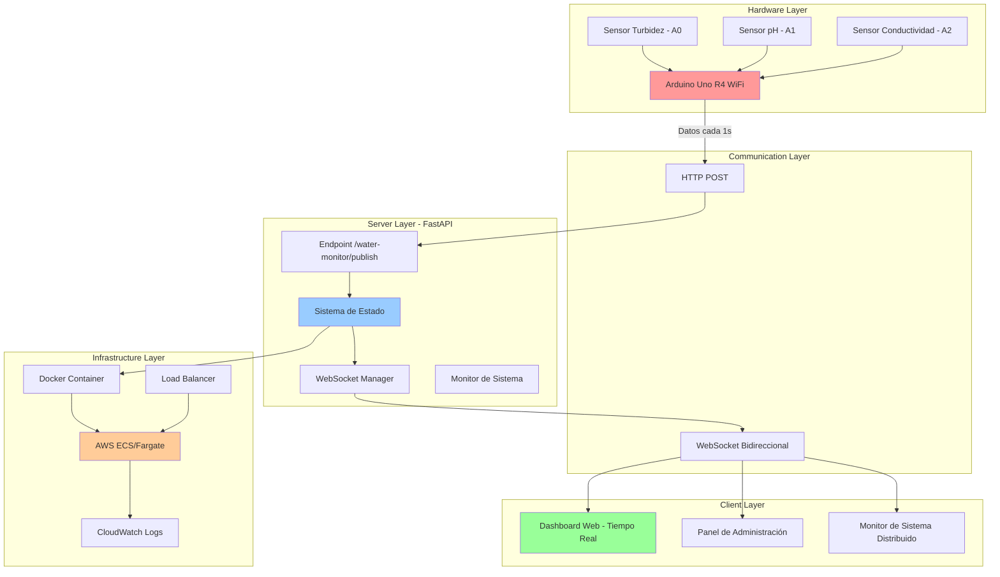
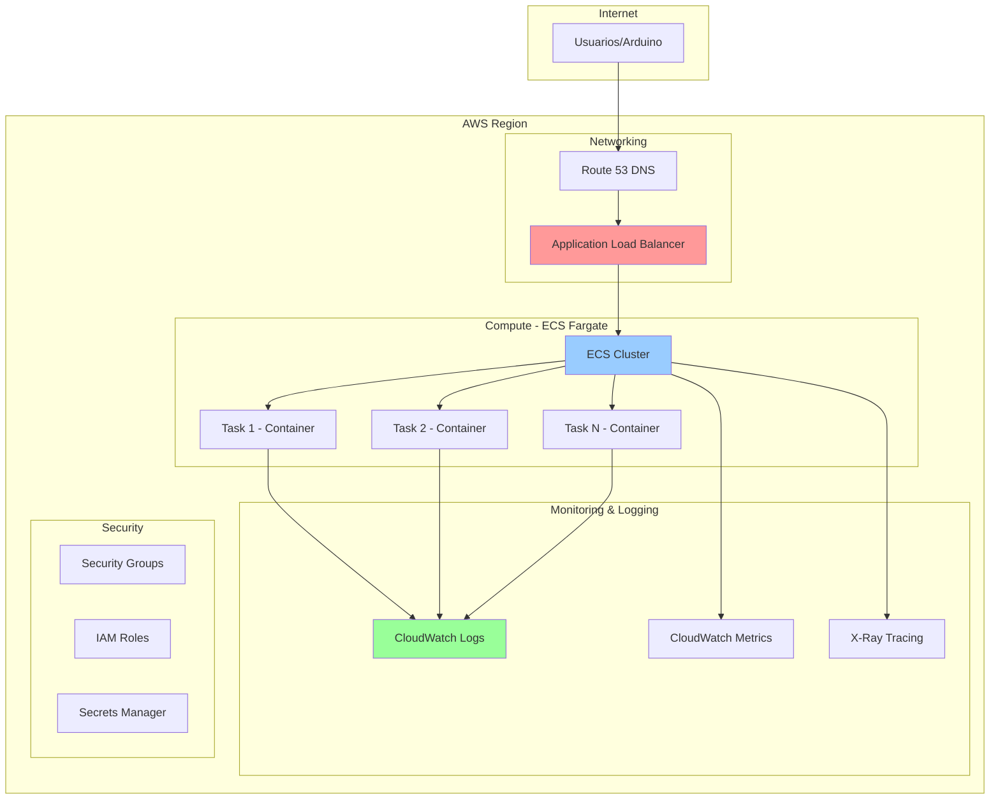

# 🌊 Sistema de Monitoreo IoT de Calidad de Agua

## 📋 Descripción del Proyecto

Sistema distribuido en tiempo real para monitoreo de calidad de agua que demuestra conceptos avanzados de **sistemas distribuidos**, **comunicación IoT** y **arquitectura moderna de software**. El proyecto integra hardware Arduino con servicios en la nube para crear una solución completa de monitoreo ambiental.

### 🎯 Objetivos del Proyecto

- **Demostración Educativa**: Enseñar conceptos de sistemas distribuidos, protocolos de comunicación y arquitecturas IoT
- **Monitoreo Real**: Sistema funcional para medir turbidez, pH y conductividad del agua
- **Escalabilidad**: Arquitectura preparada para múltiples sensores y ubicaciones
- **Observabilidad**: Sistema completo de logging, métricas y debugging

---

## 🏗️ Arquitectura del Sistema



### 🔄 Flujo de Comunicación

1. **Arduino → Servidor**: HTTP POST cada segundo con datos de sensores
2. **Servidor → Clientes**: WebSocket push automático para visualización en tiempo real
3. **Admin → Servidor**: Comandos bidireccionales via WebSocket para control del sistema
4. **Monitor → Sistema**: Observabilidad completa con métricas y logs estructurados

---

## 🛠️ Stack Tecnológico

### **Backend & API**
- **FastAPI**: Framework moderno con documentation automática (OpenAPI/Swagger)
- **WebSockets**: Comunicación bidireccional en tiempo real
- **Uvicorn**: Servidor ASGI de alto rendimiento
- **Asyncio**: Programación asíncrona para concurrencia

### **Frontend & Visualización**
- **HTML5/CSS3/JavaScript**: Frontend moderno y responsivo
- **Plotly.js**: Gráficos interactivos en tiempo real
- **WebSocket API**: Cliente JavaScript para comunicación en tiempo real

### **Hardware & IoT**
- **Arduino Uno R4 WiFi**: Microcontrolador con conectividad integrada
- **Sensores ADC**: Lectura analógica para turbidez, pH y conductividad
- **ArduinoJson**: Serialización eficiente de datos

### **DevOps & Infrastructure**
- **Docker**: Containerización con multi-stage builds optimizados
- **AWS ECS/Fargate**: Orquestación de contenedores serverless
- **AWS CloudWatch**: Logging centralizado y métricas
- **GitHub Actions**: CI/CD automatizado

---

## 📁 Estructura del Proyecto

```
iot-water-monitor/
├── 📄 main.py                     # Servidor principal FastAPI
├── 📄 water_monitor.py            # Sistema de monitoreo y WebSockets
├── 📄 system_monitor.py           # Monitor de sistema distribuido
├── 📄 logging_config.py           # Configuración de logging avanzado
├── 📄 requirements.txt            # Dependencias Python
├── 📄 dockerfile                  # Container multi-stage optimizado
├── 📄 .dockerignore              # Optimización de build context
├── 📄 main.c                     # Código Arduino (sensores + HTTP)
│
├── 📁 static/                    # Frontend y assets
│   ├── 📄 index.html             # Página principal del sistema
│   ├── 📄 ws_client.html         # Dashboard de monitoreo principal
│   ├── 📄 ws_client.js           # Cliente WebSocket con validación
│   ├── 📄 admin_dashboard.html   # Panel de administración
│   └── 📄 system_monitor.html    # Monitor de sistema distribuido
│
└── 📁 config/                   # Configuraciones
    ├── 📄 .env.example          # Variables de entorno
    └── 📄 arduino_secrets.h     # Configuración WiFi Arduino
```

---

## 🐳 Containerización con Docker

### **Estrategia Multi-Stage Build**

El proyecto utiliza una estrategia avanzada de **multi-stage build** para optimización:

```dockerfile
# Stage 1: Builder - Instalación de dependencias
FROM python:3.11-slim AS builder
WORKDIR /app
RUN apt-get update && apt-get install -y build-essential libpq-dev
COPY requirements.txt .
RUN pip install --no-cache-dir -r requirements.txt
COPY . .

# Stage 2: Runtime - Imagen final optimizada
FROM python:3.11-slim
WORKDIR /app
# Copiar solo lo necesario desde builder
COPY --from=builder /usr/local/lib/python3.11/site-packages/ /usr/local/lib/python3.11/site-packages/
COPY --from=builder /app /app

# Configuración de seguridad
RUN useradd --create-home fastapi
USER fastapi

# Health check integrado
HEALTHCHECK --interval=30s --timeout=5s --start-period=5s --retries=3 \
  CMD curl -f http://localhost:8000/health || exit 1

CMD ["uvicorn", "main:app", "--host", "0.0.0.0", "--port", "8000"]
```

### **Beneficios de esta Arquitectura**

✅ **Imagen Final Reducida**: Solo runtime sin herramientas de build  
✅ **Seguridad**: Usuario no-root, superficie de ataque mínima  
✅ **Health Checks**: Monitoreo automático del contenedor  
✅ **Optimización**: Cache layers para builds rápidos  

---

## ☁️ Deployment en AWS

### **Arquitectura de Producción en AWS**



### **Servicios AWS Utilizados**

| Servicio | Propósito | Configuración |
|----------|-----------|---------------|
| **ECS Fargate** | Orquestación serverless de contenedores | Auto-scaling based on CPU/Memory |
| **Application Load Balancer** | Distribución de tráfico con SSL termination | Health checks + sticky sessions |
| **Route 53** | DNS con failover automático | Latency-based routing |
| **CloudWatch** | Logging centralizado y métricas | Log retention + alertas personalizadas |
| **Secrets Manager** | Gestión segura de credenciales | Rotación automática |
| **VPC** | Red privada con security groups | Multi-AZ para alta disponibilidad |

### **Configuración de Deployment**

```yaml
# task-definition.json (ECS)
{
  "family": "water-monitor-task",
  "networkMode": "awsvpc",
  "requiresCompatibilities": ["FARGATE"],
  "cpu": "256",
  "memory": "512",
  "containerDefinitions": [{
    "name": "water-monitor",
    "image": "your-account.dkr.ecr.region.amazonaws.com/water-monitor:latest",
    "portMappings": [{"containerPort": 8000}],
    "logConfiguration": {
      "logDriver": "awslogs",
      "options": {
        "awslogs-group": "/ecs/water-monitor",
        "awslogs-region": "us-east-1",
        "awslogs-stream-prefix": "ecs"
      }
    },
    "healthCheck": {
      "command": ["CMD-SHELL", "curl -f http://localhost:8000/health || exit 1"],
      "interval": 30,
      "timeout": 5,
      "retries": 3
    }
  }]
}
```

---

## 🎓 Conceptos Educativos Demostrados

### **1. Sistemas Distribuidos**
- **Comunicación Asíncrona**: HTTP vs WebSockets
- **Patrón Pub/Sub**: Desacoplamiento de productores y consumidores
- **Tolerancia a Fallos**: Reconexión automática y manejo de errores
- **Observabilidad**: Logging estructurado, métricas y tracing

### **2. Protocolos de Comunicación**
- **HTTP POST**: Arduino → Servidor (eficiente en memoria)
- **WebSocket**: Servidor ↔ Clientes (comunicación bidireccional)
- **JSON**: Serialización estándar multiplataforma

### **3. Arquitectura de Software**
- **Microservices Pattern**: Separación de responsabilidades
- **Middleware Pipeline**: Logging, CORS, error handling
- **Dependency Injection**: FastAPI con type hints
- **Async/Await**: Programación concurrente en Python

### **4. DevOps y Infrastructure**
- **Infrastructure as Code**: Configuraciones declarativas
- **Container Orchestration**: ECS para escalabilidad
- **CI/CD Pipelines**: Deployment automatizado
- **Monitoring**: Observabilidad end-to-end

---

## 🚀 Instalación y Configuración

### **Desarrollo Local**

1. **Clonar el repositorio**
```bash
git clone https://github.com/tu-usuario/iot-water-monitor.git
cd iot-water-monitor
```

2. **Configurar entorno Python**
```bash
python -m venv venv
source venv/bin/activate  # Linux/Mac
# venv\Scripts\activate   # Windows
pip install -r requirements.txt
```

3. **Configurar variables de entorno**
```bash
cp .env.example .env
# Editar .env con tus configuraciones
```

4. **Ejecutar servidor de desarrollo**
```bash
python main.py
# Servidor disponible en http://localhost:8000
```

### **Docker Local**

```bash
# Build de la imagen
docker build -t water-monitor .

# Ejecutar contenedor
docker run -p 8000:8000 water-monitor

# Con docker-compose (si disponible)
docker-compose up --build
```

### **Configuración Arduino**

1. **Instalar librerías**
   - WiFiS3 (para Uno R4 WiFi)
   - ArduinoJson

2. **Configurar credenciales WiFi**
```cpp
// arduino_secrets.h
#define SECRET_SSID "TU_WIFI_SSID"
#define SECRET_PASS "TU_WIFI_PASSWORD"
```

3. **Ajustar IP del servidor**
```cpp
const char *server_host = "TU_SERVIDOR_IP";  // Cambiar por tu IP
const int server_port = 8000;
```

---

## 📊 Interfaces del Sistema

### **1. Dashboard Principal** (`/water-monitor`)
- Visualización en tiempo real de turbidez, pH y conductividad
- Gráficos interactivos con Plotly.js
- Alertas automáticas basadas en umbrales
- Estado de conexión del sistema

### **2. Panel de Administración** (`/admin-dashboard`)
- Control del modo de operación (datos reales vs simulados)
- Estadísticas del sistema y conexiones activas
- Log de eventos en tiempo real
- Configuración del sistema

### **3. Monitor de Sistema Distribuido** (`/system-monitor`)
- Visualización de topología de red
- Métricas de performance (CPU, memoria, red)
- Eventos de comunicación en tiempo real
- Debug avanzado para desarrollo

### **4. Documentación API** (`/docs`)
- Swagger UI automático
- Testing interactivo de endpoints
- Esquemas de datos y ejemplos

---

## 📈 Características Avanzadas

### **🔍 Observabilidad Completa**
- **Logging Estructurado**: JSON logs con contexto completo
- **Métricas en Tiempo Real**: CPU, memoria, conexiones, throughput
- **Health Checks**: Endpoints para monitoreo automático
- **Error Tracking**: Captura y análisis de excepciones

### **⚡ Performance Optimizado**
- **Async/Await**: Manejo concurrente de múltiples conexiones
- **Connection Pooling**: Gestión eficiente de recursos
- **Data Validation**: Pydantic para validación automática
- **Caching**: Headers HTTP para optimización

### **🔒 Seguridad Integrada**
- **CORS Configuration**: Control de origen de peticiones
- **Input Validation**: Sanitización de datos de entrada
- **Error Handling**: No exposición de información sensible
- **Container Security**: Usuario no-root, imagen minimal

### **📱 Responsive Design**
- **Mobile-First**: Diseño adaptable a dispositivos móviles
- **Real-time Updates**: Actualizaciones automáticas sin refresh
- **Progressive Enhancement**: Funcionalidad básica sin JavaScript

---

## 📚 Recursos Adicionales

### **Documentación Técnica**
- [FastAPI Documentation](https://fastapi.tiangolo.com/)
- [WebSocket Protocol](https://tools.ietf.org/html/rfc6455)
- [Docker Best Practices](https://docs.docker.com/develop/dev-best-practices/)
- [AWS ECS Documentation](https://docs.aws.amazon.com/ecs/)

### **Tutoriales y Guías**
- [Arduino IoT Guide](https://docs.arduino.cc/learn/communication/wifi)
- [Sistema Distribuidos Concepts](https://martinfowler.com/articles/microservices.html)
- [WebSocket vs HTTP](https://developer.mozilla.org/en-US/docs/Web/API/WebSockets_API)

---

## 🎯 Próximos Pasos y Mejoras

### **Funcionalidades Planeadas**
- [ ] **Base de Datos**: Almacenamiento histórico con TimescaleDB
- [ ] **Alertas**: Notificaciones email/SMS via AWS SNS  
- [ ] **Multi-sensor**: Soporte para múltiples ubicaciones
- [ ] **Machine Learning**: Predicción de calidad del agua
- [ ] **Mobile App**: Aplicación nativa con React Native

### **Mejoras de Infrastructure**
- [ ] **Auto-scaling**: Escalado automático basado en métricas
- [ ] **Blue/Green Deployment**: Deployments sin downtime
- [ ] **Monitoring**: Grafana + Prometheus para métricas avanzadas
- [ ] **Security**: WAF + Shield para protección DDoS

---

## 📄 Licencia

Este proyecto está bajo la licencia MIT. Ver `LICENSE` para más detalles.

---

## 👨‍💻 Autor

**Tu Nombre**
- GitHub: [@MCMike0399](https://github.com/MCMike0399)
- LinkedIn: [Miguel Quintero](https://www.linkedin.com/in/miguel-quintero-034a7121a/)
- Email: maquinterov0399@icloud.com

---

*Sistema de Monitoreo IoT de Calidad de Agua - Demostrando conceptos avanzados de sistemas distribuidos, comunicación en tiempo real y arquitectura moderna de software